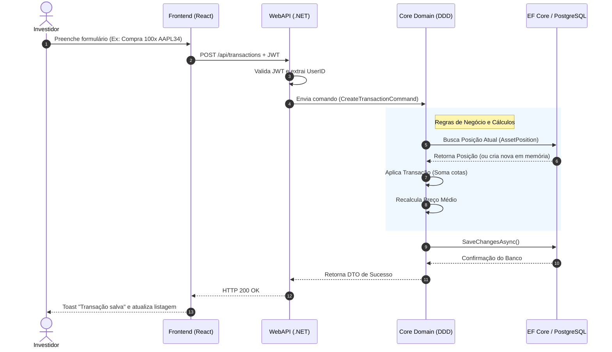
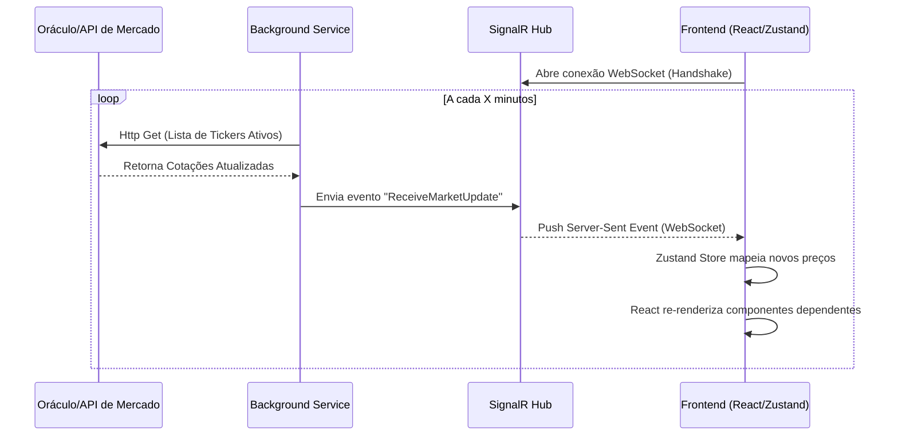

# Arquitetura do Sistema

Este documento descreve a topologia em alto nível do sistema usando a abstração do C4 Model.

## C4 Model - Diagrama de Contexto & Containers

```mermaid
graph TD
    User([Investidor])
    
    subgraph Frontend ["Frontend App (React 19 / Vite / Capacitor)"]
        Web[Dashboard Web]
        Mobile[Aplicativo Mobile nativo]
    end

    subgraph Backend ["Backend Environment (.NET 10 / DDD)"]
        API[ASP.NET Core WebAPI]
        Domain[Core Domain Model]
        Worker[Market Data Synchronizer Worker]
        Hub[SignalR Real-time Hub]
    end

    subgraph External ["External Managed Services"]
        Supabase[(Supabase PostgreSQL)]
        Auth[Supabase Auth Provider]
        MarketAPI[Market Quotation APIs / Oráculos]
    end

    User -->|Interage via Navegador| Web
    User -->|Interage via App| Mobile
    
    Web -->|REST API (HTTPS)| API
    Mobile -->|REST API (HTTPS)| API
    
    Web -->|WebSockets| Hub
    Mobile -->|WebSockets| Hub

    API -->|Validação de JWT| Auth
    API -->|Entity Framework Core| Supabase
    
    Worker -->|Fetch Ticker Prices| MarketAPI
    Worker -->|Envia Broadcast Update| Hub
    
    API -.->|Injeta e executa| Domain
    Worker -.->|Injeta e atualiza| Domain
```

## Sequence Diagram - Fluxo de Compra de Ativos (Backend DDD)

Este diagrama ilustra o fluxo de uma requisição de transação financeira, destacando a separação de responsabilidades (WebAPI -> Application -> Domain -> Infrastructure).



## Sequence Diagram - Atualizações em Tempo Real (SignalR)

Este diagrama mostra o ciclo de vida da captura de preços de mercado até a renderização no frontend via WebSockets.


