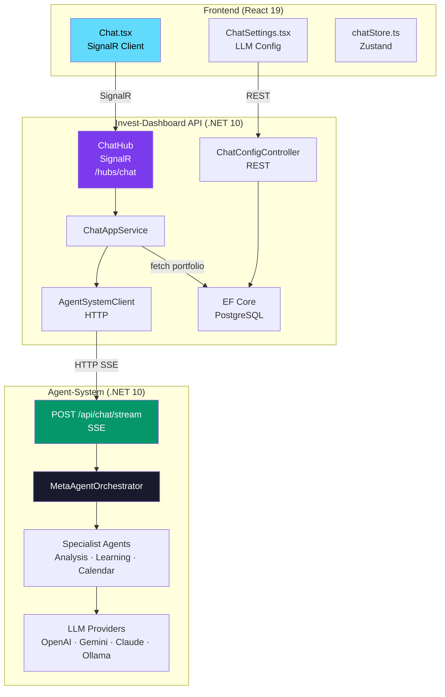
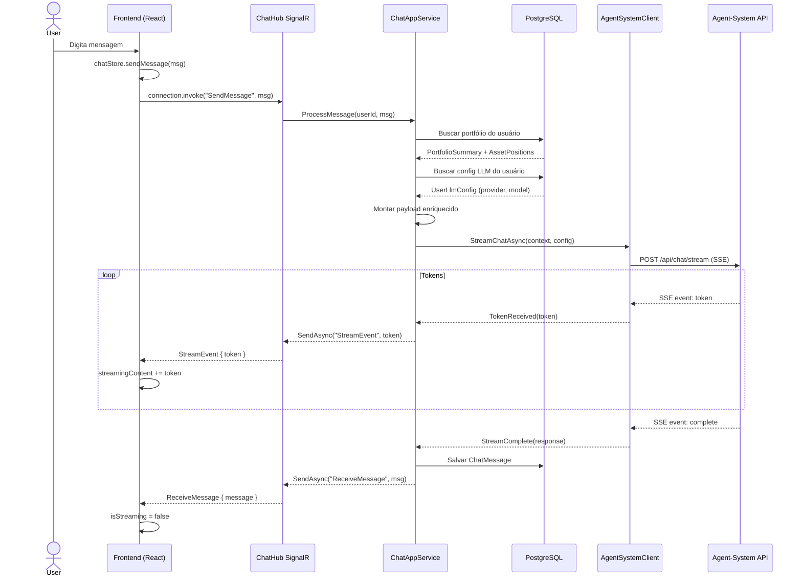
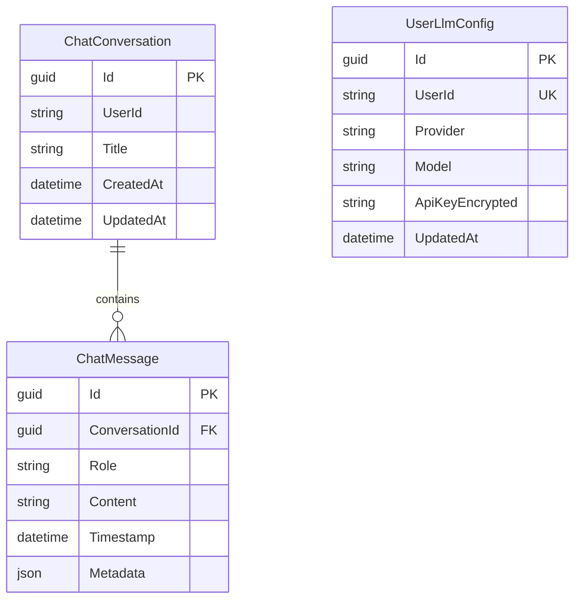
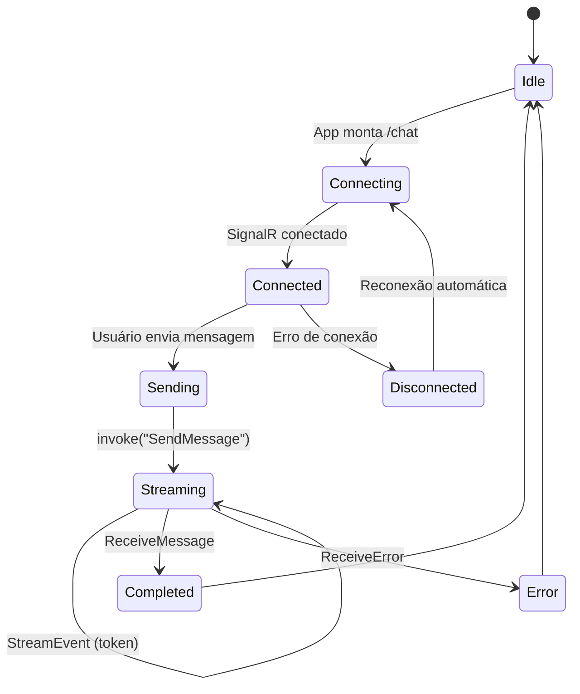
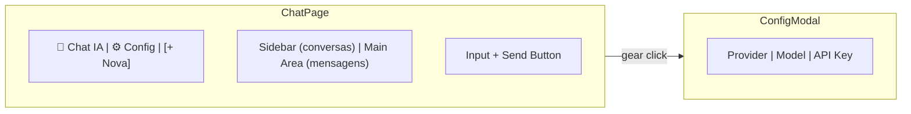
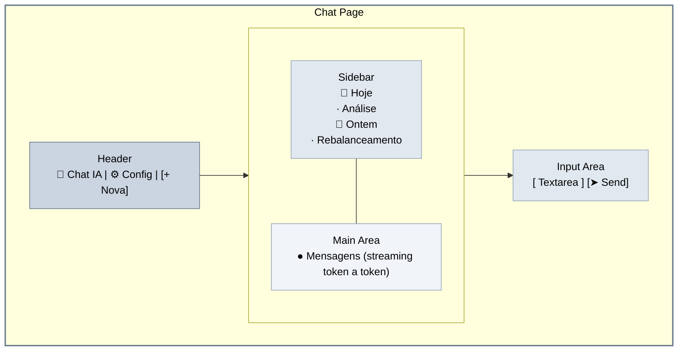
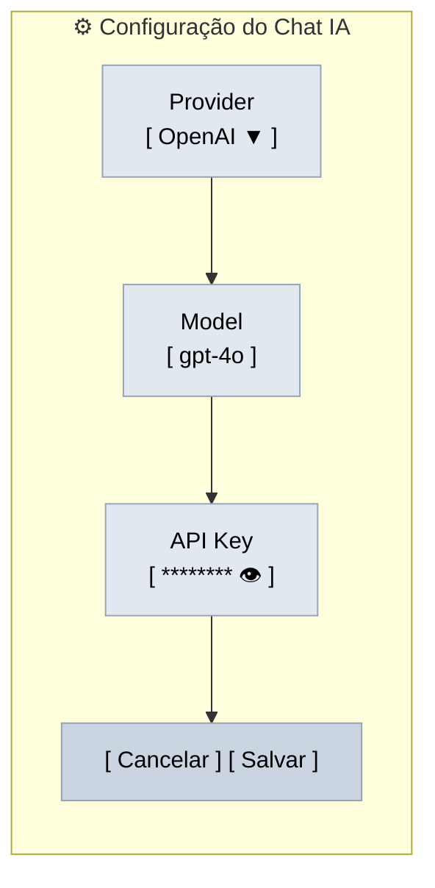

# Plano de Implementação — Chat IA: Assistente de Investimentos

## Visão Geral

Implementar o módulo **Chat IA — Assistente de Investimentos** (feature #7 do `base.md`), integrando o invest-dashboard ao **Agent-System** (serviço separado de IA) via SignalR para streaming em tempo real.

### Stack
- **Frontend:** React 19 + TypeScript + Zustand + `@microsoft/signalr`
- **Backend:** ASP.NET Core 10 + SignalR + EF Core
- **IA:** Agent-System (.NET 10 + Microsoft Agent Framework) — serviço externo
- **Streaming:** SignalR (end-to-end)
- **Config LLM:** Gerenciada pelo usuário via interface (provider, model, API key)
- **Contexto:** Dados do portfólio do banco local (PostgreSQL / EF Core)

---

## Diagramas

### Arquitetura Geral (C4 — Container)



### Arquitetura de Streaming (SignalR)



### Modelo de Dados



### Fluxo de Streaming no Frontend



### Layout da UI



---

## Fases de Implementação

### Fase 1: Backend — Domínio e Persistência

| Arquivo | Descrição |
|---------|-----------|
| `src/InvestDashboard.Domain/Entities/ChatConversation.cs` | Entidade `ChatConversation` |
| `src/InvestDashboard.Domain/Entities/ChatMessage.cs` | Entidade `ChatMessage` |
| `src/InvestDashboard.Domain/Entities/UserLlmConfig.cs` | Configuração LLM por usuário |
| `src/InvestDashboard.Domain/Repository/IChatRepository.cs` | Interface do repositório de chat |
| `src/InvestDashboard.Domain/Repository/IUserLlmConfigRepository.cs` | Interface do repositório de config LLM |
| `src/InvestDashboard.Infrastructure/Persistence/EFCore/Configurations/ChatConfiguration.cs` | EF mapping |
| `src/InvestDashboard.Infrastructure/Persistence/RepositoryImpl/ChatRepository.cs` | Implementação |
| `src/InvestDashboard.Infrastructure/Persistence/RepositoryImpl/UserLlmConfigRepository.cs` | Implementação |
| Migration | `dotnet ef migrations add CreateChatTables` |

#### Entidades

**ChatConversation**
```
Id: Guid
UserId: string (do Supabase auth)
Title: string
CreatedAt: DateTime
UpdatedAt: DateTime
Messages: List<ChatMessage>
```

**ChatMessage**
```
Id: Guid
ConversationId: Guid (FK)
Role: string ("user" | "assistant")
Content: string
Timestamp: DateTime
Metadata: JsonDocument? (dados do agente, ferramentas, etc.)
```

**UserLlmConfig**
```
Id: Guid
UserId: string (unique)
Provider: string (openai, gemini, claude, ollama)
Model: string (ex: gpt-4o, gemini-2.0-flash)
ApiKeyEncrypted: string (criptografado)
UpdatedAt: DateTime
```

---

### Fase 2: Backend — Serviços e Hub SignalR

| Arquivo | Descrição |
|---------|-----------|
| `src/InvestDashboard.Application/Interfaces/IChatAppService.cs` | Interface do serviço de chat |
| `src/InvestDashboard.Application/Services/ChatAppService.cs` | Orquestração: contexto → AgentSystem → persistência |
| `src/InvestDashboard.Infrastructure/Services/AgentSystemClient.cs` | HTTP client para chamar Agent-System |
| `src/InvestDashboard.Infrastructure/Realtime/SignalR/ChatHub.cs` | Hub SignalR para streaming de chat |
| `src/InvestDashboard.WebAPI/Controllers/ChatConfigController.cs` | CRUD de configuração LLM |

#### ChatHub — SignalR

```csharp
[Authorize]
public class ChatHub : Hub
{
    // Server methods
    public async Task SendMessage(string message, string? conversationId = null)

    // Client events
    // StreamEvent: { token: string, conversationId: string }
    // ReceiveMessage: { message: ChatMessage, conversationId: string }
    // ReceiveError: { error: string, conversationId: string }
}
```

#### ChatAppService — Responsabilidades

1. Receber mensagem do ChatHub
2. Identificar usuário via JWT (ClaimsPrincipal)
3. Carregar ou criar `ChatConversation`
4. Buscar dados do portfólio para contexto:
   - `PortfolioSummary` (valor total, rentabilidade)
   - `AssetPosition[]` (posições por ativo)
   - `RecentTransactions[]` (últimas operações)
5. Buscar `UserLlmConfig` (provider, model, apiKey)
6. Montar payload enriquecido e chamar `AgentSystemClient`
7. Receber SSE events e fazer relay como `StreamEvent` SignalR
8. Ao finalizar, salvar `ChatMessage` no DB e emitir `ReceiveMessage`

#### AgentSystemClient

- HttpClient registrado via `IHttpClientFactory`
- Chama `POST /api/chat/stream` do Agent-System
- Envia `ChatRequest` com Message + UserContext + Preferences (provider/model/apiKey)
- Lê SSE stream (`event:` / `data:`) e converte para callbacks
- Timeout configurável

---

### Fase 3: Backend — Configuração e DI

#### appsettings.json — nova seção

```json
{
  "AgentSystem": {
    "BaseUrl": "http://localhost:5001",
    "ApiKey": "",
    "TimeoutSeconds": 120
  }
}
```

#### Program.cs — registros adicionais

```csharp
// Repositories
builder.Services.AddScoped<IChatRepository, ChatRepository>();
builder.Services.AddScoped<IUserLlmConfigRepository, UserLlmConfigRepository>();

// Services
builder.Services.AddScoped<IChatAppService, ChatAppService>();
builder.Services.AddHttpClient<AgentSystemClient>();

// SignalR Hub
app.MapHub<ChatHub>("/hubs/chat").RequireAuthorization();
```

---

### Fase 4: Frontend — Dependências e Store

| Ação | Descrição |
|------|-----------|
| `npm install @microsoft/signalr` | Adicionar SignalR client |
| `frontend/src/store/chatStore.ts` | Zustand store: conexão SignalR, mensagens, conversas, config LLM |

#### chatStore — Estrutura

```typescript
interface ChatStore {
  // Connection
  connection: HubConnection | null
  isConnected: boolean

  // Conversations
  conversations: Conversation[]
  activeConversationId: string | null
  messages: Message[]

  // LLM Config
  config: LlmConfig
  configDialogOpen: boolean

  // Streaming
  isStreaming: boolean
  streamingContent: string

  // Actions
  connect: () => Promise<void>
  disconnect: () => Promise<void>
  sendMessage: (content: string) => Promise<void>
  loadConversations: () => Promise<void>
  loadConversation: (id: string) => Promise<void>
  deleteConversation: (id: string) => Promise<void>
  loadConfig: () => Promise<void>
  saveConfig: (config: LlmConfig) => Promise<void>
}
```

---

### Fase 5: Frontend — Chat com Streaming

| Arquivo | Descrição |
|---------|-----------|
| `frontend/src/pages/tools/Chat.tsx` | Reescrever com SignalR streaming + múltiplas conversas |
| `frontend/src/api/services/chatService.ts` | Atualizar: adicionar endpoints REST para histórico/config |

#### Chat.tsx — Componentes



#### Fluxo de Streaming no Frontend

1. Conectar SignalR ao `ChatHub` no startup da store
2. Usuário digita e clica enviar →
3. `chatStore.sendMessage(content)` → `connection.invoke("SendMessage", content, conversationId)`
4. `chatStore.isStreaming = true`, exibe animação de digitação
5. Evento `StreamEvent` chega → `chatStore.streamingContent += token`
6. Evento `ReceiveMessage` chega → `chatStore.streamingContent` vira mensagem completa, `isStreaming = false`
7. Evento `ReceiveError` chega → exibe erro

---

### Fase 6: Frontend — Tela de Configuração LLM

| Arquivo | Descrição |
|---------|-----------|
| `frontend/src/pages/tools/ChatSettings.tsx` | Modal/aba com formulário de configuração |

#### ChatSettings — Formulário



- Provider: select com OpenAI, Gemini, Claude, Ollama
- Model: input livre (sugestões conforme provider)
- API Key: input tipo password com toggle visibility
- Salvamento via REST (`PUT /api/v1/chat/config`)
- Acesso por ícone de engrenagem no header do Chat

---

### Fase 7: Frontend — Atualizar Mocks

| Arquivo | Descrição |
|---------|-----------|
| `frontend/src/mocks/handlers.ts` | Adicionar mocks para chat config + histórico |
| `frontend/src/mocks/README.md` | Atualizar lista de endpoints |

#### Endpoints mockados

```
GET    /api/v1/chat/conversations       → lista de conversas
GET    /api/v1/chat/conversations/:id   → mensagens de uma conversa
DELETE /api/v1/chat/conversations/:id   → excluir
GET    /api/v1/chat/config             → buscar config LLM
PUT    /api/v1/chat/config             → salvar config LLM
```

---

## Endpoints

### Hub SignalR

| Método | Direção | Descrição |
|--------|---------|-----------|
| `SendMessage(message, conversationId?)` | Client → Server | Enviar mensagem |
| `StreamEvent` | Server → Client | Token de streaming |
| `ReceiveMessage` | Server → Client | Mensagem completa |
| `ReceiveError` | Server → Client | Erro |

### REST

| Método | Rota | Descrição |
|--------|------|-----------|
| `GET` | `/api/v1/chat/conversations` | Listar conversas do usuário |
| `GET` | `/api/v1/chat/conversations/{id}` | Obter conversa com mensagens |
| `DELETE` | `/api/v1/chat/conversations/{id}` | Excluir conversa |
| `GET` | `/api/v1/chat/config` | Obter config LLM do usuário |
| `PUT` | `/api/v1/chat/config` | Salvar config LLM do usuário |

---

## Resumo de Arquivos

### Backend (novos)

| Caminho | Tipo |
|---------|------|
| `src/InvestDashboard.Domain/Entities/ChatConversation.cs` | Entidade |
| `src/InvestDashboard.Domain/Entities/ChatMessage.cs` | Entidade |
| `src/InvestDashboard.Domain/Entities/UserLlmConfig.cs` | Entidade |
| `src/InvestDashboard.Domain/Repository/IChatRepository.cs` | Interface |
| `src/InvestDashboard.Domain/Repository/IUserLlmConfigRepository.cs` | Interface |
| `src/InvestDashboard.Application/Interfaces/IChatAppService.cs` | Interface |
| `src/InvestDashboard.Application/Services/ChatAppService.cs` | Serviço |
| `src/InvestDashboard.Infrastructure/Realtime/SignalR/ChatHub.cs` | Hub SignalR |
| `src/InvestDashboard.Infrastructure/Services/AgentSystemClient.cs` | Client HTTP |
| `src/InvestDashboard.Infrastructure/Persistence/EFCore/Configurations/ChatConfiguration.cs` | EF mapping |
| `src/InvestDashboard.Infrastructure/Persistence/RepositoryImpl/ChatRepository.cs` | Repository |
| `src/InvestDashboard.Infrastructure/Persistence/RepositoryImpl/UserLlmConfigRepository.cs` | Repository |
| `src/InvestDashboard.WebAPI/Controllers/ChatConfigController.cs` | Controller REST |
| Migration: `CreateChatTables` | EF Core |

### Backend (modificados)

| Caminho | Mudança |
|---------|---------|
| `src/InvestDashboard.WebAPI/Program.cs` | Registrar DI, mapear `ChatHub` |

### Frontend (novos)

| Caminho | Tipo |
|---------|------|
| `frontend/src/store/chatStore.ts` | Zustand store |
| `frontend/src/pages/tools/ChatSettings.tsx` | UI de configuração |

### Frontend (modificados)

| Caminho | Mudança |
|---------|---------|
| `frontend/package.json` | Adicionar `@microsoft/signalr` |
| `frontend/src/pages/tools/Chat.tsx` | Reescrever com SignalR streaming |
| `frontend/src/api/services/chatService.ts` | Adicionar métodos de histórico/config |
| `frontend/src/mocks/handlers.ts` | Adicionar mocks de chat |
| `frontend/src/mocks/README.md` | Atualizar lista de endpoints |

---

## Observações

- **Agent-System**: Porta e autenticação configuráveis via UI (tela de configuração)
- **Segurança**: API Key do LLM criptografada no banco (UserLlmConfig.ApiKeyEncrypted)
- **Contexto**: Quando Supabase estiver operacional, os dados de portfólio virão de lá — a interface `IChatAppService` já abstrai essa troca
- **Docker Compose**: Futuramente incluir Agent-System como serviço adicional
