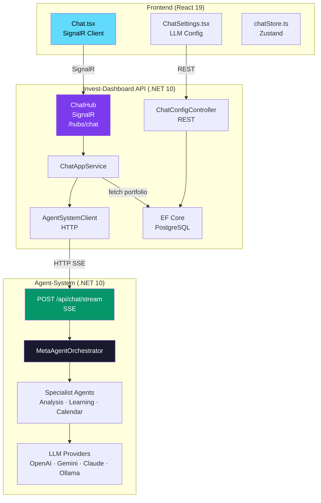
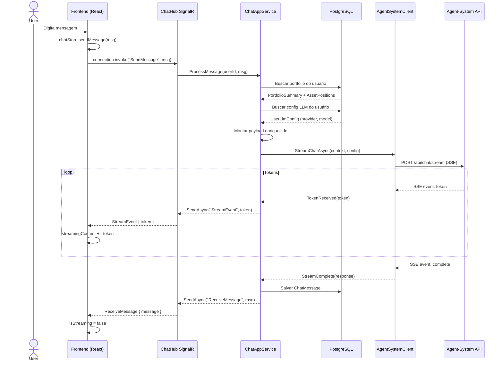
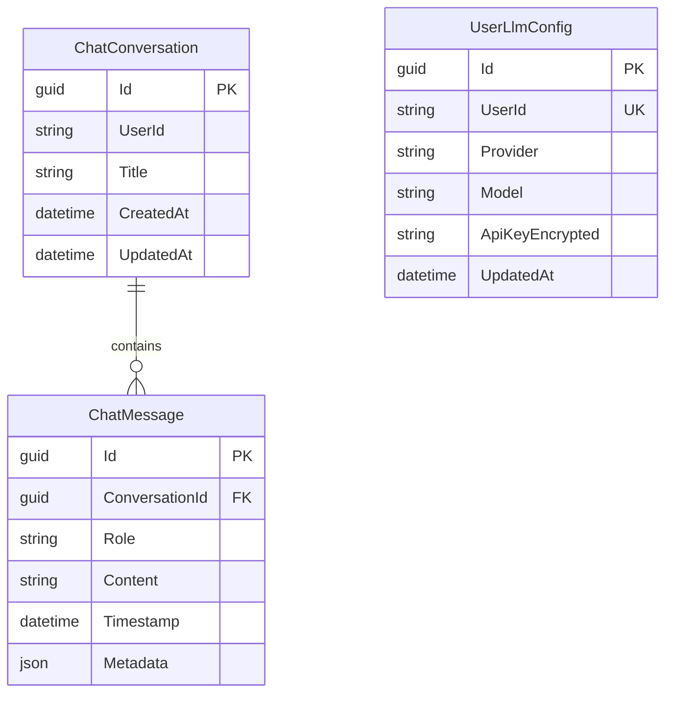

# Plano de Implementação — Chat IA: Assistente de Investimentos

## Visão Geral

Implementar o módulo **Chat IA — Assistente de Investimentos** (feature #7 do `base.md`), integrando o invest-dashboard ao **Agent-System** (serviço separado de IA) via SignalR para streaming em tempo real.

### Stack
- **Frontend:** React 19 + TypeScript + Zustand + `@microsoft/signalr`
- **Backend:** ASP.NET Core 10 + SignalR + EF Core
- **IA:** Agent-System (.NET 10 + Microsoft Agent Framework) — serviço externo
- **Streaming:** SignalR (end-to-end)
- **Config LLM:** Gerenciada pelo usuário via interface (provider, model, API key)
- **Contexto:** Dados do portfólio do banco local (PostgreSQL / EF Core)

---

## Diagramas

### Arquitetura Geral (C4 — Container)



### Arquitetura de Streaming (SignalR)



### Modelo de Dados



---

## Fases de Implementação

### Fase 1: Backend — Domínio e Persistência

| Arquivo | Descrição |
|---------|-----------|
| `src/InvestDashboard.Domain/Aggregates/Chat/ChatConversation.cs` | Entidade `ChatConversation` |
| `src/InvestDashboard.Domain/Aggregates/Chat/ChatMessage.cs` | Entidade `ChatMessage` |
| `src/InvestDashboard.Domain/Aggregates/Chat/UserLlmConfig.cs` | Configuração LLM por usuário |
| `src/InvestDashboard.Domain/Repository/IChatRepository.cs` | Interface do repositório de chat |
| `src/InvestDashboard.Domain/Repository/IUserLlmConfigRepository.cs` | Interface do repositório de config LLM |
| `src/InvestDashboard.Infrastructure/Persistence/EFCore/Configurations/ChatConversationConfiguration.cs` | EF mapping |
| `src/InvestDashboard.Infrastructure/Persistence/EFCore/Configurations/ChatMessageConfiguration.cs` | EF mapping |
| `src/InvestDashboard.Infrastructure/Persistence/EFCore/Configurations/UserLlmConfigConfiguration.cs` | EF mapping |
| `src/InvestDashboard.Infrastructure/Persistence/RepositoryImpl/ChatRepository.cs` | Implementação |
| `src/InvestDashboard.Infrastructure/Persistence/RepositoryImpl/UserLlmConfigRepository.cs` | Implementação |
| Migration | `dotnet ef migrations add CreateChatTables` |

### Fase 2: Backend — Serviços e Hub SignalR

| Arquivo | Descrição |
|---------|-----------|
| `src/InvestDashboard.Application/Interfaces/IChatAppService.cs` | Interface do serviço de chat |
| `src/InvestDashboard.Application/Services/ChatAppService.cs` | Orquestração: contexto → AgentSystem → persistência |
| `src/InvestDashboard.Infrastructure/Services/AgentSystemClient.cs` | HTTP client para chamar Agent-System |
| `src/InvestDashboard.Infrastructure/Realtime/SignalR/ChatHub.cs` | Hub SignalR para streaming de chat |
| `src/InvestDashboard.WebAPI/Controllers/ChatConfigController.cs` | CRUD de configuração LLM |

### Fase 3: Frontend — Dependências e Store

| Ação | Descrição |
|------|-----------|
| `npm install @microsoft/signalr` | Adicionar SignalR client |
| `frontend/src/store/chatStore.ts` | Zustand store |

### Fase 4: Frontend — Chat com Streaming

| Arquivo | Descrição |
|---------|-----------|
| `frontend/src/pages/tools/Chat.tsx` | Reescrever com SignalR streaming |

### Fase 5: Frontend — Tela de Configuração LLM

| Arquivo | Descrição |
|---------|-----------|
| `frontend/src/pages/tools/ChatSettings.tsx` | Modal de configuração |

---

## Endpoints

### Hub SignalR

| Método | Direção | Descrição |
|--------|---------|-----------|
| `SendMessage(message, conversationId?)` | Client → Server | Enviar mensagem |
| `StreamEvent` | Server → Client | Token de streaming |
| `ReceiveMessage` | Server → Client | Mensagem completa |
| `ReceiveError` | Server → Client | Erro |

### REST

| Método | Rota | Descrição |
|--------|------|-----------|
| `GET` | `/api/v1/chat/conversations` | Listar conversas do usuário |
| `GET` | `/api/v1/chat/conversations/{id}` | Obter conversa com mensagens |
| `DELETE` | `/api/v1/chat/conversations/{id}` | Excluir conversa |
| `GET` | `/api/v1/chat/config` | Obter config LLM do usuário |
| `PUT` | `/api/v1/chat/config` | Salvar config LLM do usuário |

---

## Resumo de Arquivos

### Backend (novos)

| Caminho | Tipo |
|---------|------|
| `src/InvestDashboard.Domain/Aggregates/Chat/ChatConversation.cs` | Entidade |
| `src/InvestDashboard.Domain/Aggregates/Chat/ChatMessage.cs` | Entidade |
| `src/InvestDashboard.Domain/Aggregates/Chat/UserLlmConfig.cs` | Entidade |
| `src/InvestDashboard.Domain/Repository/IChatRepository.cs` | Interface |
| `src/InvestDashboard.Domain/Repository/IUserLlmConfigRepository.cs` | Interface |
| `src/InvestDashboard.Application/Interfaces/IChatAppService.cs` | Interface |
| `src/InvestDashboard.Application/Services/ChatAppService.cs` | Serviço |
| `src/InvestDashboard.Infrastructure/Realtime/SignalR/ChatHub.cs` | Hub SignalR |
| `src/InvestDashboard.Infrastructure/Services/AgentSystemClient.cs` | Client HTTP |
| `src/InvestDashboard.Infrastructure/Persistence/EFCore/Configurations/*Configuration.cs` | EF mappings |
| `src/InvestDashboard.Infrastructure/Persistence/RepositoryImpl/ChatRepository.cs` | Repository |
| `src/InvestDashboard.Infrastructure/Persistence/RepositoryImpl/UserLlmConfigRepository.cs` | Repository |
| `src/InvestDashboard.WebAPI/Controllers/ChatConfigController.cs` | Controller REST |
| Migration: `CreateChatTables` | EF Core |

---

## ⚠️ Pontos de Atenção (Review)

| # | Item | Severidade | Descrição |
|---|------|------------|-----------|
| 1 | **Criptografia da API Key** | Alta | O plano menciona `ApiKeyEncrypted` mas não define **como** será criptografado. Precisa de um serviço de criptografia (ex: `IDataProtector` do ASP.NET Core ou AES) |
| 2 | **Entidades em pasta correta** | Média | O projeto usa `Domain/Aggregates/`, não `Domain/Entities/`. Usar `Domain/Aggregates/Chat/` |
| 3 | **Tratamento de desconexão SignalR** | Alta | Precisa de retry policy, buffer de mensagens pendentes, timeout |
| 4 | **SSE → SignalR relay** | Alta | Se o SSE cair no meio do stream, o que acontece? Precisa de timeout, cleanup e notificação de erro |
| 5 | **Paginação de conversas** | Baixa | `GET /conversations` não menciona paginação |
| 6 | **Contexto do portfólio no payload** | Média | Não define o formato exato do payload enviado ao Agent-System. Precisa de DTO `ChatContext` |
| 7 | **Limite de tokens/contexto** | Média | Não há menção a limites de contexto (max tokens, truncar histórico) |
| 8 | **Falta Fase de Testes** | Média | Nenhuma fase menciona testes unitários ou de integração |
| 9 | **Compatibilidade com MSW** | Baixa | MSW não suporta SignalR. Precisa definir fallback para dev mode |
| 10 | **Cancelamento de streaming** | Baixa | Não há menção a como o usuário pode parar uma resposta em andamento |

---

## 💡 Sugestões de Melhoria

1. **Adicionar seção de criptografia** — Usar `IDataProtector` (ASP.NET Core Data Protection)
2. **Adicionar DTO `ChatContext`** — Formato do payload enviado ao Agent-System:
   ```csharp
   public class ChatContext {
       public string Message { get; set; }
       public PortfolioSummaryDto Portfolio { get; set; }
       public AssetPositionDto[] Positions { get; set; }
       public TransactionDto[] RecentTransactions { get; set; }
       public UserLlmConfigDto LlmConfig { get; set; }
   }
   ```
3. **Adicionar política de retry SignalR** — Configurar `withAutomaticReconnect([0, 2, 10, 30])`
4. **Adicionar limite de histórico** — Truncar mensagens antigas para não exceder context window
5. **Adicionar fase de testes** — Unit tests para `ChatAppService` e `AgentSystemClient`
6. **Definir fallback para MSW** — Simulação de streaming no frontend quando `VITE_USE_MSW=true`

---

## 📊 Avaliação Geral

| Critério | Nota | Comentário |
|----------|------|------------|
| Completude | 8/10 | Cobre bem backend + frontend, falta testes e edge cases |
| Clareza | 9/10 | Diagramas e tabelas tornam o plano muito legível |
| Viabilidade | 8/10 | Técnico sólido, depende do Agent-System estar disponível |
| Consistência | 7/10 | Convenções de pastas agora corrigidas |
| Segurança | 7/10 | Boa base, mas precisa detalhar criptografia da API Key |

**Nota geral: 7.8/10** — Plano muito bem estruturado, com ajustes menores fica pronto para execução.